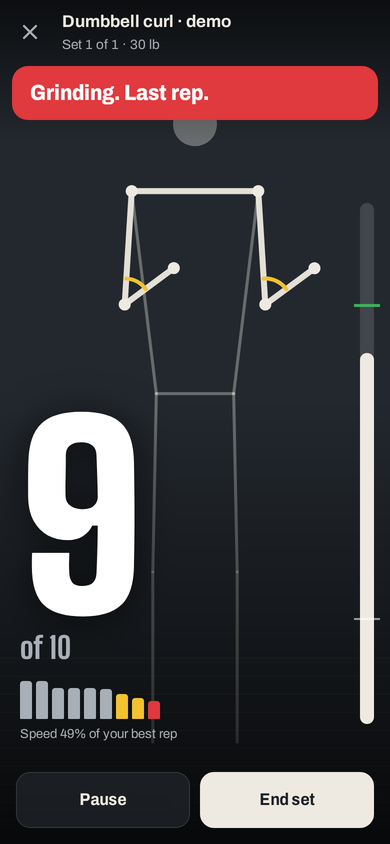
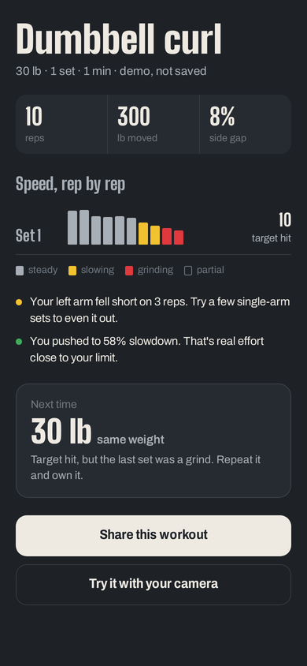
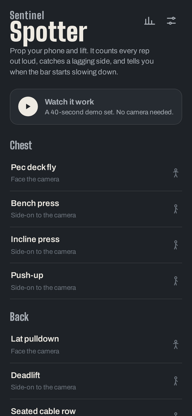
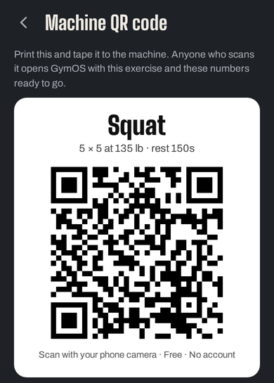

# Sentinel Spotter

*Formerly GymOS.*

**The spotter in your phone.** Prop it up, lift, and it counts every rep out loud, catches a lagging side, and tells you when the bar is slowing down, so you can stop counting and focus on the muscle.

**[Open Sentinel Spotter →](https://jameskeithharwood.com/gymos/)** · free · runs in the browser · no account · [watch the 40-second demo](https://jameskeithharwood.com/gymos/?demo)

<p>




</p>

---

## Why it exists

When you lift with a training partner, something changes. You stop counting. You stop monitoring yourself. You zone out and just move the weight. That mental offloading isn't a comfort feature. Focusing on the muscle beats focusing on counting, the clock, or the mirror.

Every other fitness app pulls you *into* your screen during a set. Sentinel Spotter pushes the screen into your peripheral vision. The voice handles everything, including the commands, so you never have to touch the phone.

Sentinel Spotter began as an answer to a friend who was tired of workout apps that need your attention mid-set.

## What it does

| | |
|---|---|
| **Counts every rep out loud** | A rep only counts when you get back to where you started after reaching full range. Half reps are flagged as partials and not counted. On squats and bench, the rep counts when you stand or lock out, so a rep you get stuck on is never counted. |
| **Tells you when you're slowing down** | Spotter times the lifting part of every rep. When it slows by 30% from your best rep, you hear *"Slowing down. A couple left."* At 45%: *"Grinding. Last rep."* Speed loss is a standard fatigue signal in strength training. |
| **Calls out a lagging side** | Facing the camera, it tracks both arms separately and tells you *"Left arm is lagging"* when one side falls short. |
| **Catches stalls** | If the weight stops moving mid-rep you hear *"Drive!"* If it stays stuck: *"Rack it. Safety first."* |
| **Learns how you move** | Two slow warm-up reps teach Spotter your personal range of motion and your camera angle, instead of guessing from fixed angles. |
| **Coaches tempo** | Drop the weight too fast twice in a row and it says *"Control the way down."* |
| **Runs the whole session** | Ends the set when you rest or step away, runs the rest timer, counts you into the next set. |
| **Hands-free** | Say "end set", "pause", "resume", "skip", "more time", "end workout". Spotter ignores its own voice so it never triggers itself. |
| **Remembers and progresses** | History is saved on your phone. The next session's weight is recommended from how your last one went: every set hit with speed to spare means go up, a grind means repeat, two rough sessions mean back off. |
| **Machine QR codes** | Make a printable QR code for any machine. Scanning it opens Sentinel Spotter with that exercise and plan ready to go. |
| **Shareable results** | One tap makes a branded image of your workout's speed chart for social media. |
| **Installs like an app, works offline** | Add it to your home screen. After the first visit, it works with no signal. |

## Exercise library

16 exercises. Each one is a schema entry in [`engine.js`](engine.js). The engine has no per-exercise code.

| Face the camera | Side-on to the camera |
|---|---|
| Dumbbell curl · Hammer curl · Shoulder press · Lateral raise · Lat pulldown · Pec deck fly | Bench press · Incline press · Push-up · Squat · Deadlift · Romanian deadlift · Seated cable row · Tricep pushdown · Leg extension · Seated leg curl |

Side-on exercises track whichever side faces the camera. Facing-camera exercises track both sides and measure the gap between them. The pec deck fly is tracked by the distance between your hands relative to your shoulder width. That fixes the old version's blind spot for that movement.

## How it works

```
camera → MediaPipe Pose Landmarker (on-device, GPU) → 3D joint positions
       → joint angle or hand span, smoothed (One Euro filter)
       → progress through YOUR calibrated range, from 0 to 1
       → rep state machine: start → out → full range → back to start = rep
       → per rep: speed of the lifting phase, side gap, lowering tempo
       → coaching cues through a priority voice queue (safety > count > cue)
```

* **3D world landmarks** rather than flat image coordinates, so angles hold up when a limb moves toward the camera.
* **Speed is measured on the lifting phase only**, between 20% and 80% of your range, so pauses and slow lowering never look like fatigue. In face-on exercises it's timed on the leading arm, so a lagging arm shows up as asymmetry, not fatigue.
* **The engine is pure JavaScript with no DOM.** It runs in Node, where 27 tests drive simulated lifters through it.

## Privacy

Your camera feed is processed on your phone and is never recorded or uploaded. History lives in your browser's storage on that device. There's no account and no server.

One honest caveat: voice commands use your browser's built-in speech recognition, and some browsers (Chrome, for example) process that audio on their own servers. Turn voice commands off in Settings to keep everything on the phone. Spoken coaching (the app talking to you) is always local.

## Safety

Sentinel Spotter is not a substitute for a human spotter or safety bars on heavy barbell lifts. Its stall alert tells you to rack the weight. It cannot catch it.

## Running and testing

There's no build step. It's a static site: `index.html`, `engine.js`, `sw.js`, `manifest.json`, `icons/`.

```bash
python3 -m http.server 8765          # serve locally, then open http://localhost:8765
node tests/engine.test.js            # 27 engine tests with simulated lifters, no camera
npm i playwright && npx playwright install chromium
node tests/ui-walkthrough.mjs        # clicks through every screen with a fake camera, runs the demo
node tests/ui-flow.mjs               # full workout through the real camera path with simulated poses
```

The camera needs HTTPS (or localhost). GitHub Pages serves it over HTTPS.

## Camera setup tips

* 6–8 feet away, phone propped at about hip height. A water bottle, gym bag or bench works.
* Face-on exercises: both arms fully in frame. Side-on exercises: the joints listed on the setup screen.
* Good light helps. The position check turns each joint chip green when Spotter can see it.
* The **Accurate** tracking setting is better for side-on lifts and uses more battery.

## Roadmap

- [x] Rep counting that requires full range, returns to start, and works side-on (v5)
- [x] Calibration, speed-loss fatigue alerts, stall alerts, tempo coaching (v5)
- [x] QR and URL loading, saved history, progression, offline, installable (v5)
- [ ] **Workout programs:** an ordered list of exercises that routes you machine to machine
- [ ] **Rep-in-reserve estimate**, learned per user from their own speed-loss history
- [ ] **Bar path view** for squat, bench and deadlift
- [ ] **Gym partner kit:** standard phone mount spec, QR stands, anonymized per-machine usage
- [ ] **Optional sync:** accounts, multiple devices, coach and client sharing, Apple Health and Google Fit export

## Version history

| Version | What it was | Try it |
|---|---|---|
| **v5.1** (Oct 2026) | Renamed from GymOS to Sentinel Spotter |  |
| **v5** (Oct 2026) | Phone spotter rebuild: speed-loss fatigue alerts, calibration, 16 exercises, history, QR codes, offline | [current](https://jameskeithharwood.com/gymos/) |
| v4 (May 2026) | Seven-exercise schema, flexion/extension movement types, exercise picker | [archived](https://jameskeithharwood.com/gymos/legacy/v4.html) |
| v3 (May 2026) | First MVP: curl rep counting, voice commands, rest timer | [archived](https://jameskeithharwood.com/gymos/legacy/v3.html) |

The archived builds live in [`legacy/`](legacy/) and are kept as they were, apart from a banner pointing to the current version.

## Built by

James Keith Harwood II
Sentinel AI Systems, Antonito, Colorado
[jameskeithharwood.com](https://www.jameskeithharwood.com)

Built in partnership with Claude (Anthropic).

## License

Copyright (c) 2026 James Keith Harwood II, Sentinel AI Systems. All Rights Reserved.

This software may not be copied, modified, distributed, or used in any commercial setting without express written permission from the copyright holder. Viewing and personal evaluation are permitted.

The concepts embodied in this software constitute documented prior art originating with James Keith Harwood II, established through timestamped development records in 2026. They include camera-based bilateral asymmetry detection during strength training, schema-driven exercise configuration, on-device rep counting via pose estimation, voice-commanded gym sessions, and QR-code-driven workout delivery to gym machines.

For commercial licensing and partnership inquiries: [jameskeithharwood.com](https://www.jameskeithharwood.com). Collaboration is by arrangement.

See [license.md](./license.md) for full terms.
